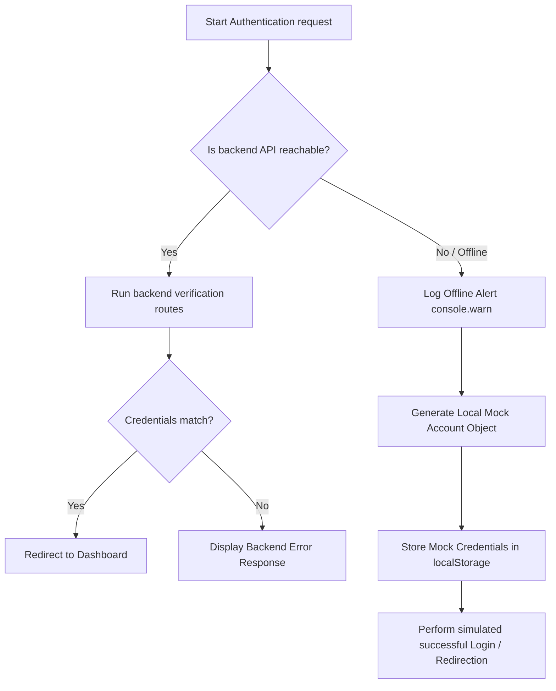

# TaskForge Authentication & Login Error Documentation

This document compiles, explains, and maps all validation, client-side, backend, middleware, and network offline fallback errors that a user might encounter during the authentication flow in **TaskForge**.

---

## 1. Client-Side Input Validation Errors

Before any API request is sent to the backend server, input fields are validated in the frontend to reduce unnecessary server load and provide instant feedback to the user.

- **Form Fields Check**: Handled during submission in [Auth.jsx](file:///c:/Users/about/OneDrive/Desktop/dailyTask/src/components/Auth.jsx#L112-L233).
- **Core Input Validation**: Checked inside [AppContext.jsx](file:///c:/Users/about/OneDrive/Desktop/dailyTask/src/context/AppContext.jsx#L275-L290).

### Client-Side Validation Matrix

| Authentication Mode | Component / Source | Trigger Condition | Error Message Displayed | UI Treatment / Icon |
| :--- | :--- | :--- | :--- | :--- |
| **Login** | [Auth.jsx](file:///c:/Users/about/OneDrive/Desktop/dailyTask/src/components/Auth.jsx#L118-L121) | Email or password fields are blank on submit. | `Please enter your email and password` | Alert Banner / `AlertCircle` |
| **Register** | [Auth.jsx](file:///c:/Users/about/OneDrive/Desktop/dailyTask/src/components/Auth.jsx#L139-L142) | Any of Full Name, Email, Password, or Confirm Password are empty. | `Please fill in all fields` | Alert Banner / `AlertCircle` |
| **Register** | [Auth.jsx](file:///c:/Users/about/OneDrive/Desktop/dailyTask/src/components/Auth.jsx#L143-L146) | Password does not match Confirm Password field. | `Passwords do not match` | Alert Banner / `AlertCircle` |
| **Register** | [Auth.jsx](file:///c:/Users/about/OneDrive/Desktop/dailyTask/src/components/Auth.jsx#L147-L150) | The "Terms of Service & Privacy Policy" checkbox is unchecked. | `You must accept the Terms of Service & Privacy Policy` | Alert Banner / `AlertCircle` |
| **Register** | [AppContext.jsx](file:///c:/Users/about/OneDrive/Desktop/dailyTask/src/context/AppContext.jsx#L278-L281) | Full Name length is less than 3 or greater than 50 characters. | `Name must be between 3 and 50 characters` | Alert Banner / `AlertCircle` |
| **Register** | [AppContext.jsx](file:///c:/Users/about/OneDrive/Desktop/dailyTask/src/context/AppContext.jsx#L282-L285) | Email address fails standard regex test (`/^[^\s@]+@[^\s@]+\.[^\s@]+$/`). | `Please enter a valid email address` | Alert Banner / `AlertCircle` |
| **Register** | [AppContext.jsx](file:///c:/Users/about/OneDrive/Desktop/dailyTask/src/context/AppContext.jsx#L286-L290) | Password length is less than 8 characters. | `Password must be at least 8 characters long` | Alert Banner / `AlertCircle` |
| **Register** | [AppContext.jsx](file:///c:/Users/about/OneDrive/Desktop/dailyTask/src/context/AppContext.jsx#L286-L290) | Password lacks at least one uppercase letter (`[A-Z]`). | `Password must contain at least one uppercase letter` | Alert Banner / `AlertCircle` |
| **Register** | [AppContext.jsx](file:///c:/Users/about/OneDrive/Desktop/dailyTask/src/context/AppContext.jsx#L286-L290) | Password lacks at least one lowercase letter (`[a-z]`). | `Password must contain at least one lowercase letter` | Alert Banner / `AlertCircle` |
| **Register** | [AppContext.jsx](file:///c:/Users/about/OneDrive/Desktop/dailyTask/src/context/AppContext.jsx#L286-L290) | Password lacks at least one numeric digit (`[0-9]`). | `Password must contain at least one number` | Alert Banner / `AlertCircle` |
| **Register** | [AppContext.jsx](file:///c:/Users/about/OneDrive/Desktop/dailyTask/src/context/AppContext.jsx#L286-L290) | Password lacks at least one special character (`[!@#$%^&*(),.?":{}|<>]`). | `Password must contain at least one special character` | Alert Banner / `AlertCircle` |
| **Forgot Password** | [Auth.jsx](file:///c:/Users/about/OneDrive/Desktop/dailyTask/src/components/Auth.jsx#L169-L172) | The Email field is blank when requesting a recovery link. | `Please enter your email address` | Alert Banner / `AlertCircle` |
| **Reset Password** | [Auth.jsx](file:///c:/Users/about/OneDrive/Desktop/dailyTask/src/components/Auth.jsx#L189-L192) | Token, Password, or Confirm Password fields are empty. | `Please fill in all fields` | Alert Banner / `AlertCircle` |
| **Reset Password** | [Auth.jsx](file:///c:/Users/about/OneDrive/Desktop/dailyTask/src/components/Auth.jsx#L193-L196) | Password does not match Confirm Password. | `Passwords do not match` | Alert Banner / `AlertCircle` |
| **OTP Verification** | [Auth.jsx](file:///c:/Users/about/OneDrive/Desktop/dailyTask/src/components/Auth.jsx#L215-L218) | The 6-digit OTP code input is blank when submitting. | `Please enter the 6-digit verification code` | Alert Banner / `AlertCircle` |

---

## 2. Backend Authentication API Errors

The backend router [authRoutes.js](file:///c:/Users/about/OneDrive/Desktop/dailyTask/api/routes/authRoutes.js) forwards requests to the controllers in [authController.js](file:///c:/Users/about/OneDrive/Desktop/dailyTask/api/controllers/authController.js). Each endpoint yields deterministic error status codes and payload structures.

### A. User Registration (`POST /api/auth/register`)
Used when creating a new local email-password account profile.

*   **Status: `400 Bad Request`**
    ```json
    { "message": "All fields are required" }
    ```
    *Trigger:* Request body lacks `fullName`, `username`, `email`, or `password`.
*   **Status: `400 Bad Request`**
    ```json
    { "message": "Email already registered" }
    ```
    *Trigger:* Database lookup finds an active user with the same email.
*   **Status: `400 Bad Request`**
    ```json
    { "message": "Username already taken" }
    ```
    *Trigger:* Database lookup finds an active user with the same username.
*   **Status: `500 Internal Server Error`**
    ```json
    { "message": "Internal server error" }
    ```
    *Trigger:* Database connection issue or system exception during bcrypt hashing / document write.

---

### B. Email Verification OTP (`POST /api/auth/verify-email`)
Enforced right after registration or if a user attempts to log into an unverified account.

*   **Status: `400 Bad Request`**
    ```json
    { "message": "Email and verification code are required" }
    ```
    *Trigger:* Post payload has blank `email` or `code`.
*   **Status: `404 Not Found`**
    ```json
    { "message": "User not found" }
    ```
    *Trigger:* Attempting to verify an email address not present in the database.
*   **Status: `400 Bad Request`**
    ```json
    { "message": "Invalid verification code" }
    ```
    *Trigger:* Code inputted does not match the active `verificationToken` stored in user db document.
*   **Status: `400 Bad Request`**
    ```json
    { "message": "Verification code has expired" }
    ```
    *Trigger:* Current timestamp is past the user's `verificationTokenExpires` timestamp (valid for 15 minutes after generation).
*   **Status: `500 Internal Server Error`**
    ```json
    { "message": "Internal server error" }
    ```
    *Trigger:* Database write failures when setting `emailVerified: true` or updating fields.

---

### C. Account Login (`POST /api/auth/login`)
Standard credentials authentication endpoint.

*   **Status: `400 Bad Request`**
    ```json
    { "message": "Email and password are required" }
    ```
    *Trigger:* Payload misses `email` or `password` parameters.
*   **Status: `400 Bad Request`**
    ```json
    { "message": "Invalid credentials" }
    ```
    *Trigger:* Either the user account doesn't exist under that email, or the bcrypt comparison failed (wrong password).
    > [!NOTE]
    > To prevent account enumeration attacks, the API returns a generic `"Invalid credentials"` error for both email errors and password mismatches.
*   **Status: `500 Internal Server Error`**
    ```json
    { "message": "Internal server error" }
    ```
    *Trigger:* Database exceptions or server errors during bcrypt comparison.

---

### D. Password Recovery Flow

#### 1. Recovery Request (`POST /api/auth/forgot-password`)
*   **Status: `400 Bad Request`**
    ```json
    { "message": "Email is required" }
    ```
    *Trigger:* Email parameter missing from the request body.
*   **Status: `404 Not Found`**
    ```json
    { "message": "No user registered with this email" }
    ```
    *Trigger:* No user account matches the provided email.
*   **Status: `500 Internal Server Error`**
    ```json
    { "message": "Internal server error" }
    ```
    *Trigger:* Exception when saving the reset token or expiry timestamp in the database.

#### 2. Password Reset execution (`POST /api/auth/reset-password`)
*   **Status: `400 Bad Request`**
    ```json
    { "message": "Token and new password are required" }
    ```
    *Trigger:* Missing `token` or `password` parameters in request payload.
*   **Status: `400 Bad Request`**
    ```json
    { "message": "Invalid or expired reset token" }
    ```
    *Trigger:* If no database user matches the active `verificationToken`.
*   **Status: `400 Bad Request`**
    ```json
    { "message": "Reset token has expired" }
    ```
    *Trigger:* If the token matches, but the current timestamp exceeds the `verificationTokenExpires` timestamp (valid for 1 hour after generation).
*   **Status: `500 Internal Server Error`**
    ```json
    { "message": "Internal server error" }
    ```
    *Trigger:* Server errors when hashing the new password or writing to the database.

---

### E. OAuth & Third-Party Authentication Endpoints

#### 1. Google Sign-In (`POST /api/auth/google`)
*   **Status: `400 Bad Request`**
    ```json
    { "message": "Google access token is required" }
    ```
    *Trigger:* Request body is missing the `accessToken` string parameter.
*   **Status: `400 Bad Request`**
    ```json
    { "message": "Invalid or expired Google access token" }
    ```
    *Trigger:* Fetch call to Google's userinfo endpoint (`https://www.googleapis.com/oauth2/v3/userinfo`) returns a non-OK status, or the returned user payload does not contain an email address.
*   **Status: `500 Internal Server Error`**
    ```json
    { "message": "Internal server error" }
    ```
    *Trigger:* Network failures or errors updating/creating user profiles in the database.

#### 2. OAuth Simulation (`POST /api/auth/oauth/simulate`)
*   **Status: `400 Bad Request`**
    ```json
    { "message": "Provider, email, and fullName are required" }
    ```
    *Trigger:* Request body lacks any of `provider`, `email`, or `fullName`.
*   **Status: `500 Internal Server Error`**
    ```json
    { "message": "Internal server error" }
    ```

---

### F. Data Synchronization & Account Management

#### 1. Get User Data (`GET /api/auth/data`)
*   **Status: `404 Not Found`**
    ```json
    { "message": "User not found" }
    ```
    *Trigger:* Authenticated user's ID encoded in JWT cannot be found in the database.
*   **Status: `500 Internal Server Error`**
    ```json
    { "message": "Internal server error" }
    ```

#### 2. Save User Data (`POST /api/auth/data`)
*   **Status: `404 Not Found`**
    ```json
    { "message": "User not found" }
    ```
    *Trigger:* User not found during update write.
*   **Status: `500 Internal Server Error`**
    ```json
    { "message": "Internal server error" }
    ```

#### 3. Delete Account (`DELETE /api/auth/account`)
*   **Status: `404 Not Found`**
    ```json
    { "message": "User not found" }
    ```
    *Trigger:* User ID from JWT is not found in database records.
*   **Status: `500 Internal Server Error`**
    ```json
    { "message": "Internal server error" }
    ```

---

## 3. Security & Middleware Errors

These errors protect protected API endpoints (such as dashboard data syncing and account deletions) and prevent route abuse.

### A. Authorization Middleware ([auth.js](file:///c:/Users/about/OneDrive/Desktop/dailyTask/api/middleware/auth.js))
Intercepts incoming HTTP headers matching standard JWT expectations.

*   **Status: `401 Unauthorized`**
    ```json
    { "message": "Authorization token required" }
    ```
    *Trigger:* The incoming request header `Authorization` is completely missing or is not prefixed with `Bearer `.
*   **Status: `401 Unauthorized`**
    ```json
    { "message": "User unauthorized" }
    ```
    *Trigger:* The token is decoded successfully, but the `id` payload maps to a user who does not exist in the database (e.g. account has been deleted).
*   **Status: `401 Unauthorized`**
    ```json
    { "message": "Invalid or expired token" }
    ```
    *Trigger:* The JWT verification `jwt.verify()` fails. This occurs when:
    *   The token has expired (JWT expiry duration reached).
    *   The signature is invalid (wrong private key / secret key mismatch).
    *   The token is corrupted or malformed.

### B. Rate Limiting Middleware ([rateLimiter.js](file:///c:/Users/about/OneDrive/Desktop/dailyTask/api/middleware/rateLimiter.js))
Enforces standard rate limiting protections across authentication endpoints to mitigate brute force attacks.

*   **Status: `429 Too Many Requests`**
    ```json
    { "message": "Too many requests from this IP, please try again after 15 minutes" }
    ```
    *Trigger:* Exceeding **100 API requests** in any sliding window of **15 minutes** from a single IP address.

---

## 4. Offline Fallbacks & Simulated Authentication Behaviors

To maintain a seamless local developer experience, TaskForge incorporates client-side catch blocks in [AppContext.jsx](file:///c:/Users/about/OneDrive/Desktop/dailyTask/src/context/AppContext.jsx) that handle service interruptions if the backend Express server is offline or database properties are not configured.



### Fallback Mechanisms Matrix

Whenever a fetch request to `${API_BASE}` fails (e.g., throwing a `TypeError: Failed to fetch` because the node backend server is offline), the frontend falls back to these mock flows:

| Attempted Action | Failure Scenario / Trigger | Fallback Behavior / Simulation Treatment |
| :--- | :--- | :--- |
| **Registration** | API Connection Refused | Logs warning: `[Auth Server Offline] Falling back to simulated register`. Generates a random 6-digit mock code and returns it as a simulated code, displaying the mock SMTP banner containing the OTP to bypass backend email generation. |
| **Standard Login** | API Connection Refused | Logs warning: `[Auth Server Offline] Falling back to simulated login`. Authenticates instantly by building a developer dummy profile `{ id: 'default_user', fullName: 'TaskForge Developer', email, authProviders: ['Email'] }` and storing it in local storage under `taskforge_mock_user`. |
| **Email Verification** | API Connection Refused | Logs warning: `[Auth Server Offline] Falling back to simulated verification`. Instantly logs user in with the client-side mock user. |
| **Google Sign-In** | `VITE_GOOGLE_CLIENT_ID` missing / dummy value | Logs warning: `[Google Auth] Using simulated OAuth fallback...`. Skips calling the browser Google Identity SDK and directly posts to `/api/auth/oauth/simulate` to trigger simulated backend OAuth linking. |
| **Google Sign-In** | SDK Init Error / Server Offline | Logs error: `Google Auth init error: [Error]`. Directly logs user in with localized mock credentials `google_user@gmail.com` under `google_user` profile, bypassing API communication. |
| **GitHub Sign-In** | Always simulated | Since GitHub does not have browser SDK configuration, the frontend defaults to calling `/api/auth/oauth/simulate`. If the backend server is offline, it catches the error and logs warning: `[Auth Server Offline] Falling back to simulated GitHub login`, and signs user in with local mock credentials. |
| **Forgot Password** | API Connection Refused | Logs warning: `[Auth Server Offline] Falling back to simulated password recovery`. Returns simulated code `'mock_reset_token'` and presents it inside the SMTP recovery banner. |
| **Reset Password** | API Connection Refused | Logs warning: `[Auth Server Offline] Falling back to simulated password reset`. Shows banner `"Password reset successful! Please log in. (Mock)"` and redirects the user to the login screen. |
| **Logout** | API Connection Refused | Logs warning: `[Auth Server Offline] Logging out locally`. Clears token and all state/local storage variables locally. |
| **Delete Account** | API Connection Refused | Logs warning: `[Auth Server Offline] Deleting account locally`. Bypasses backend deletion and deletes user credentials and objectives cache from the browser storage. |
| **Data Sync (Load/Save)**| API Connection Refused | Logs warning: `[Sync] Failed to fetch fresh data...` or `[Sync] Failed to sync data...`. Bypasses network errors completely; relies entirely on browser-persisted localStorage cache keys structured under `taskforge_tasks_{userId}`, `taskforge_future_{userId}`, `taskforge_weekly_{userId}`, etc. |
